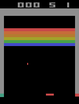

Reimplementation of [Human-level control through deep reinforcement learning](https://www.nature.com/articles/nature14236.pdf)

See our [writeup](writeup.pdf) for more details about the project and our implementation.

# Training
To launch training, run:
```bash
python train.py --replay_buffer_capacity 1e5 --replay_start_size 1e5
```

# Create Figures
To generate figures, run:
```bash
python figures.py --n_episodes 100 --n_seconds 45
```

# Example Results
On the left, we see the agent using a random policy.
On the right, we see the agent using policy learned after training.

 
 

# TODO
- Figure generation sometimes hangs or takes exceedingly long; as a result, we have not yet collated GIFs+scores for all games. After fixing this bug, we can expand our results table and include GIFs
- Training hyperparameters may need further tuning for optimal results
- figure generation should use `pandas.DataFrame.from_dict(...).to_latex()` to produce scores table more easily
